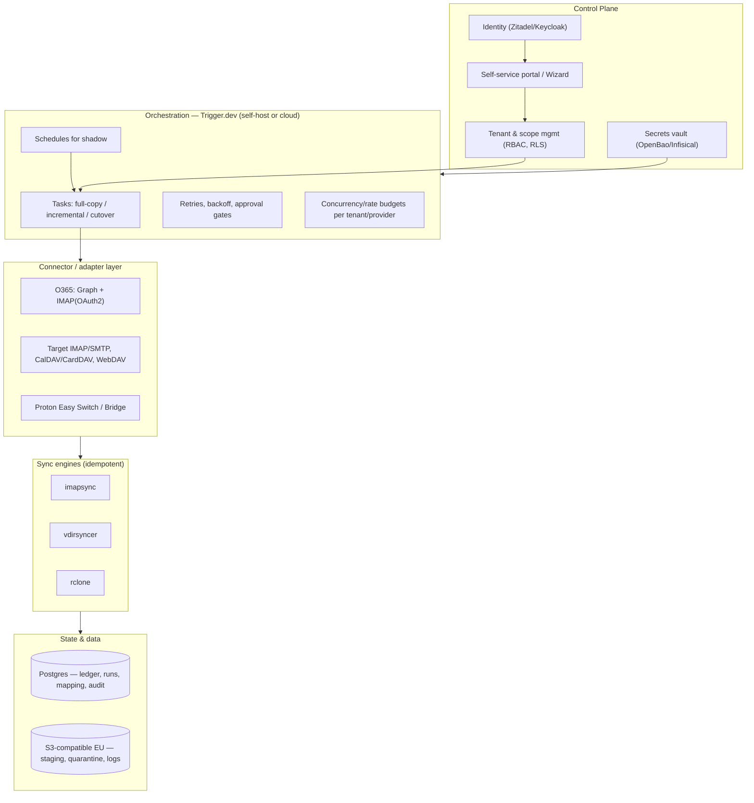
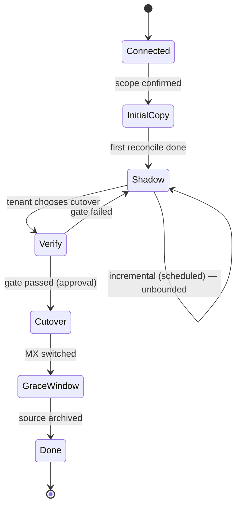

# Solution Architecture — Sovereign Migration Stack

**Version:** 1.1 (review baseline) — canonical copy, lives in `docs/architecture/`.
**v1.1 change:** added release management, versioning & data-migration controls (§22.1) and the migration-tooling decision (ADR-0017); clarified self-hosted targets are user-operated (ADR-0011); ledger schema v1 (`packages/ledger`, ADR-0016).
**Languages:** English is the development language (code, docs, ADRs). The end-user UI and interaction are bilingual: **English + Dutch** (§23).
**Subject:** A low-maintenance stack that lets families and small/medium businesses migrate, at their own pace, off US cloud (Microsoft 365 / Google / Dropbox) to **managed EU/CH platforms** for email, calendar, contacts, files and related features.
**First migration path:** Microsoft 365 (O365) → Soverin / Nextcloud (Proton later).

---

## 1. Purpose & context
Many households and small organisations are locked into O365 (or Google/Dropbox) but want to move to European, standards-based alternatives for sovereignty and privacy. The hard part is not the destination but the *transition*: fear of data loss, no time for a big-bang cutover, and no IT department.

The stack solves this with three core properties plus one ambition:
- **Idempotent transfer** — a migration may be re-run any number of times without duplicates or corruption; re-running always converges to the same end state.
- **Shadow-running** — the sovereign environment runs in parallel with O365 for as long as the user wants, kept incrementally up to date; the user chooses the cutover moment.
- **Low-maintenance, EU-managed** — built on proven open-source sync engines, deployed on managed EU IaaS/PaaS/SaaS, with IaC/GitOps so operations are minimal.
- **A lasting interop layer (ambition)** — the same adapters that migrate later serve as a gateway so users can use sovereign services in any app and are never locked to one vendor again.

## 2. Goals & non-goals
**Goals**
- Self-service migration per tenant, no central IT required.
- Full-fidelity transfer of email (folders/Sent/Drafts/Archive, flags, attachments), calendar, contacts and files.
- Cheap continuous incremental sync during the shadow period.
- Two delivery editions from one core: self-host (hobbyist) and a managed service.
- GDPR-compliant processing with EU/CH data residency.

**Non-goals (for now)**
- Not full Exchange/SharePoint feature parity (workflows, Teams history, OneNote, retention holds).
- No migration of Teams chat/calls or Planner in v0.
- No *reliable bidirectional email sync in steady state* (a targeted asymmetric path exists — §11).
- **We do not host email ourselves.** Recommended targets are managed EU/CH platforms. Self-hosted targets (incl. self-hosted email, e.g. Stalwart/Mailcow) are *permitted* — they are standard endpoints — but **operated by the user; we take no responsibility for their hosting/deliverability/uptime** (§9, ADR-0011). (The self-host *edition of the migration tool* is a separate thing — see §7.)
- **Post-migration identity/login in the target suite is out of scope.** How users authenticate to Soverin/Nextcloud/Proton afterwards is the target platform's and the user's choice; we only handle the credentials/app-passwords needed for migration.

## 3. Confirmed decisions
1. **Two editions, one core.** A self-host edition (NAS/Pi/Spark, optionally single-user) and a managed multi-tenant service. Only the control plane differs; the migration core and idempotency are identical (§7).
2. **Targets are managed EU/CH cloud platforms, in clusters.** Soverin/Nextcloud (default) and Proton (optional, family/individual). No self-hosted mail (§9). [ADR-0011]
3. **Shadow = one-way mirror + clean cutover**, with one asymmetric exception (send from the new environment while inbound still lands on O365) and bidirectional allowed for calendar/contacts/files (§11).
4. **Residency = EU + Switzerland.** US providers (and CLOUD Act exposure) excluded.
5. **Scale = small (family to SMB).** ~25 mailboxes per tenant, a few shared mailboxes (§21).
6. **Permissions: covered, not necessarily automated** — inventory + guidance, auto-apply only where mapping is clean (§14.2).
7. **Source extraction prefers Graph** (+ IMAP+OAuth2 for mail); EWS/DavMail avoided because Microsoft is retiring EWS in 2026 (§13). [ADR-0012]
8. **Language:** English for code/docs; end-user UI in English + Dutch (§23). [ADR-0013]
9. **License Apache-2.0; orchestration Trigger.dev (managed) + in-process scheduler (self-host); TypeScript** (§24).

## 4. Actors
- **Tenant admin** — head of household or business owner; connects sources/targets, sets scope, starts migration, chooses cutover.
- **End user** — owns one or more mailboxes/accounts.
- **Operator** — runs the managed service (you), with minimal manual effort.
- **Self-host admin** — runs the self-host edition on their own hardware.
- **Support** — read access to status/logs, no access to content.

## 5. Requirements
**Functional:** connect source via OAuth (O365) and targets via credentials/OAuth; choose scope (mailboxes, folders, calendars, address books, drives, date range); choose mode (one-time / one-way mirror / asymmetric or bidirectional where safe); set schedule (continuous shadow vs one-shot); track progress/errors and per-item status; reconciliation report; cutover wizard with verification gate and DNS/MX guidance; (managed) self-service onboarding, billing, tenant isolation.

**Non-functional:** idempotency & resumability as the correctness guarantee (crucial for intermittent self-host hosts); low-maintenance (managed-first + IaC/GitOps + auto-updates); scalable (thousands of tenants in cheap delta shadow); secure & GDPR-compliant (EU/CH residency, data minimisation, encryption, audit log, right to erasure); throttle-tolerant (respects O365 Graph/IMAP and target limits); accessible bilingual UI (§23).

## 6. Architecture principles
1. **Normalise to standards; reuse engines.** Adapters turn each source/target into a standard protocol (IMAP, CalDAV, CardDAV, WebDAV). Proven engines (imapsync, vdirsyncer, rclone) do the inherently idempotent transfer.
2. **Idempotency lives in the engines + a ledger**, not the orchestrator — so the orchestrator is swappable and the self-host edition can use a much lighter scheduler.
3. **Non-destructive by default.** A one-way mirror never touches the source; rollback before cutover is simply keeping O365.
4. **One core, two control planes.** Engine and ledger layers are identical; only the control plane differs per edition.
5. **Managed-first + IaC-always** (managed service); **local-first + dependency-light** (self-host).
6. **Honest about limits.** Where a target lacks an open protocol (Proton calendar/contacts), we claim no live sync but offer the best achievable (snapshots).

## 7. Delivery model: two editions from one core
The same codebase yields (a) a **self-host edition** someone runs on their own hardware (NAS/Pi/Spark), optionally single-user, and (b) a **managed multi-tenant service** you host for people without a server. Only the control plane differs.

### 7.1 Self-host edition (the hobbyist)
One all-in-one bundle in several packagings: **Docker Compose** (NAS/mini-PC/Pi/laptop), a **Home Assistant add-on** (Supervisor-managed), and an optional **hybrid agent** registered to the managed control plane that executes locally so the operator never sees content. Because everything is idempotent + delta, an intermittently-on host resumes cleanly. No heavy orchestrator runs here. (This is about *where the tool runs*; it is **not** self-hosted email — targets remain managed EU/CH platforms.)

### 7.2 Managed edition (operated by you, low effort)
Multi-tenant (`tenant_id` + Postgres RLS, per-tenant workspaces/rate budgets), cost-recovery billing (§16), tenant isolation, SSO/IdP, autoscaling workers, managed Postgres/object storage, low-ops via GitOps + auto-updates.

### 7.3 What is shared and what differs
| Layer | Shared (identical) | Self-host | Managed |
|---|---|---|---|
| Engines | imapsync/vdirsyncer/rclone + Graph extractor | idem | idem |
| Adapters/connectors | O365/IMAP/WebDAV/CalDAV/CardDAV/Proton | idem | idem |
| Migration core | reconcile + idempotency + ledger schema | idem | idem |
| UI | scope manifest, status, decision queue (§11.2) | idem (single-user) | idem (per tenant) |
| **Orchestration** | interface `Scheduler/JobRunner` | **in-process** (croner) | **Trigger.dev** (self-host or cloud) |
| **State** | ledger contract | **small Postgres (bundled)** | **managed Postgres + RLS** |
| **Tenancy** | — | single | multi-tenant (RLS) |
| **Secrets** | — | OS keychain / age-encrypted file | vault (OpenBao/Infisical) |
| **Auth** | — | local / single-user | IdP/SSO (Zitadel) |
| **Provisioning** | `TargetProvisioner` interface | `ManualProvisioner` | `ManualProvisioner` + `ApiProvisioner` |
| **Billing** | — | none | cost-recovery (Mollie) |

Core rule: **orchestration, state, tenancy, secrets, auth, provisioning and billing are the only axes that differ per edition; everything above (core + UI) is one codebase.**

## 8. Logical architecture (managed; self-host is the slimmed variant)

In the **self-host edition** the heavy orchestration layer is replaced by an in-process scheduler, the ledger is embedded, and there is a single tenant.

## 9. Targets: choosing an EU/CH destination
Underlying capability matrix:

| Domain | O365 source (read) | Soverin | Nextcloud | Proton |
|---|---|---|---|---|
| **Email** | IMAP + OAuth2 (XOAUTH2) or Graph | IMAP/SMTP -> imapsync | no mail host (client only) | Easy Switch import; continuous only via Bridge (paid, heavy) |
| **Calendar** | **Graph** | CalDAV -> vdirsyncer | CalDAV -> vdirsyncer | Easy Switch import; no CalDAV |
| **Contacts** | **Graph** | CardDAV -> vdirsyncer | CardDAV -> vdirsyncer | Easy Switch import; no CardDAV |
| **Files** | OneDrive/SharePoint via Graph -> rclone | n/a | WebDAV -> rclone | weak/no sync API |
| **Office** | n/a | n/a | Collabora/OnlyOffice | Proton Docs (limited) |

Three choice clusters (recommended targets are managed EU/CH; **self-hosted targets, incl. self-hosted email, are permitted but user-operated** — we migrate into them, we don't host them, ADR-0011):

### 9.1 Cluster A — "Maximum privacy, one provider" (Proton) — *optional; mainly family/individual*
Replaces Gmail+Calendar+Drive+Docs+1Password with one Swiss E2E-encrypted suite. Strong on encryption/simplicity; weak on open-protocol interop (mail only via Bridge; calendar/contacts only via ICS/vCard snapshots), continuous shadow, Drive migration, and **no shared mailboxes/delegation** -> poor SMB fit (§9.4). Migration via Easy Switch + forwarding.

### 9.2 Cluster B — "Open standards & app freedom" (Soverin + Nextcloud) — *recommended default*
Replaces Gmail/Outlook with Soverin (mail/calendar/contacts, NL, own domain) and Drive/Dropbox/OneDrive+Docs+Photos with Nextcloud (WebDAV, Collabora/OnlyOffice, Photos, Talk). Works with any client (IMAP/CalDAV/CardDAV/WebDAV), no lock-in, full idempotent + shadow sync. Soverin also offers native shared/team calendars, e-mail groups, catch-all/forwarding (SRS/ARC), app passwords and OpenPGP. Migration via imapsync + vdirsyncer + rclone.

### 9.3 EU/CH alternatives within cluster B, and sovereign public-sector suites
Mail alternatives: Mailfence (BE, CalDAV + EU), Mailbox.org (DE, Open-Xchange-based), Posteo (DE), Infomaniak kSuite (CH). Nextcloud may be a managed EU Nextcloud or one the user already runs.

**Open-Xchange (OX App Suite)** deserves special mention: OX serves mail/calendar/contacts over **IMAP/SMTP, CalDAV and CardDAV**, so any OX-based service is a first-class target via our existing engines (many EU hosts offer OX, e.g. Mailbox.org).

**Sovereign public-sector suites.** Because the stack is target-agnostic — any standards endpoint (ADR-0011) — government "sovereign workplace" suites are supportable to the extent they expose open protocols:
- **openDesk** (Germany, ZenDiS) bundles **Open-Xchange** (mail/cal/contacts over IMAP/CalDAV/CardDAV) + **Nextcloud** (files over WebDAV) + Collabora/Element/Jitsi/OpenProject/XWiki. Its mail/cal/contacts/files map exactly onto cluster B, so **openDesk is a supportable target with no new connectors**, and it ships as a self-hostable community edition *and* a managed SaaS — viable for SMBs and self-hosters. Proof point: Schleswig-Holstein migrated 40,000+ accounts and 100M+ mail/calendar items off Microsoft Exchange to Open-Xchange in late 2025.
- **La Suite numérique** (France, DINUM) and its **SaaS resellers** are a different case from openDesk. The gov-hosted instance is public-sector-only, but the open-source bricks are resold as **managed SaaS** by third parties — notably **mosa.cloud** (and the Dutch **MijnBureau** is the same family) — so *availability is not the blocker*. The blocker is **protocol**: the La Suite mail brick (**Messages**) **deliberately ships no IMAP** ("no POP3 or IMAP, by design"; JMAP-inspired data model), and the stack is **JMAP-first**, with calendar/contacts/files following the same modern-protocol path rather than CalDAV/CardDAV/WebDAV. So this family is reached via the **JMAP adapter**, which is now the stack's **primary target path** (§13.2, ADR-0018) — not via imapsync/DAV. The bespoke apps (Docs, Grist, Meet, Chat) stay out of scope.

The bespoke collaboration apps in these suites (Matrix chat, no-code databases, video, collaborative editors) are out of scope — exactly as Teams/Planner are (§11.2).

### 9.4 Proton positioning
Proton's E2E/zero-access encryption is exactly what blocks openness — no CalDAV/CardDAV, mail only via Bridge, and no Exchange-style shared mailboxes/delegation (only aliases to individual accounts). Keep Proton as an **optional** family/individual destination via one-time Easy Switch import + forwarding (deferred past MVP), never as a continuous-shadow target; Bridge interop only in the self-host/local edition. Default remains cluster B.

## 10. Data domains & idempotency
| Domain | Natural key | Change detection | Engine |
|---|---|---|---|
| Email | `Message-ID` (fallback: hash of normalised headers+body) | hash + size | imapsync |
| Calendar/Tasks | iCal `UID` (+ `RECURRENCE-ID`) | ETag/hash | vdirsyncer |
| Contacts | vCard `UID` | ETag/hash | vdirsyncer |
| Files | normalised path | size + mtime + checksum | rclone (`--checksum`, `bisync`) |

**Reconcile loop:** enumerate source delta -> compute natural key + content hash -> look up ledger -> decide create/update/skip/delete -> apply -> upsert ledger. Re-running with no source change => all "skip" => no side effects => **idempotent**. Cheap deltas: Graph delta queries; IMAP `CONDSTORE`/`QRESYNC`; CalDAV/CardDAV `sync-collection` (RFC 6578); rclone checksum/modtime diff.

### 10.1 Folders, Sent items and special-use folders
- **Full folder tree by default.** imapsync copies all folders, so Inbox, **Sent**, Drafts, Archive, Junk, Trash and subfolders all migrate.
- **Special-use mapping (RFC 6154):** "Sent Items" (O365) is mapped to the target Sent (`\Sent`), and likewise `\Drafts`/`\Junk`/`\Trash`/`\Archive`, so the client recognises them correctly.
- **Sent is continuously synced during shadow** (idempotent on Message-ID), not just on the initial copy.
- **With asymmetric sending (§11):** the target accumulates its own new sends while O365-Sent is synced in one-way, so at cutover the target holds the complete Sent history; Message-ID keys de-duplicate.

### 10.2 Data-fidelity edge cases (scoped for families/SMB)
Cover the common 95% automatically; inventory + guide the rare bits.
- **Encrypted/signed mail (S/MIME, PGP):** migrated as opaque MIME (preserved, not decrypted).
- **Flags/categories/importance:** preserved where standard IMAP supports them.
- **Signatures, out-of-office, server-side rules/filters:** not messages -> surfaced as guided manual steps (§14.2).
- **Online/archive mailbox:** treated as an additional mailbox to migrate.
- **Recurring-event exceptions & time zones:** handled via iCal UID + RECURRENCE-ID.
- **Target message-size limits:** oversize items detected and flagged rather than silently dropped.

## 11. Shadow-running & cutover
**Modes:** A — one-way mirror (default; user keeps using O365, sovereign stays warm/validated). B — bidirectional for calendar/contacts/files only (vdirsyncer / `rclone bisync`; conflict policy: hash-equality -> last-writer-wins by mtime -> keep-both + flag). **Asymmetric path** ("send from new, receive on old"): MX stays on O365 (inbound mirrored), but you already send from the sovereign environment — either send-as the existing address (needs SPF/DKIM for both providers; DMARC `p=none` during transition) or from the new address. Mail stays one-way until cutover.

**Email cutover:** final delta -> optional source read-only/forwarding -> switch MX/DNS + autodiscover -> reconfigure clients -> grace window with reverse read -> archive. A **verification gate** (counts/checksums within tolerance) is an approval step before the DNS switch.

### 11.1 Discovery & drift: the old system changes during shadow
A scheduled **discovery process** detects source/target changes and sorts each into: **automatic** (safe/additive: new mail/events/files, flag changes, new alias), **owner decision** (topology/cost/destructive/identity/ambiguous: new mailbox, deletion, quota, shared-address pattern, offboarding), or **alert** (errors: auth failure, over-quota, stalls). Core principle: **the source is authoritative for content; the owner is authoritative for topology/lifecycle decisions; deletions are never auto-propagated.** Enablers: stable identity via the immutable Graph GUID (renames are updates, not delete+create), and policy presets per category (cautious owners review each; experienced owners auto-approve categories). A useful side effect: because deletions are not mirrored, the new environment often becomes a *fuller* archive than the shrinking source.

### 11.2 User control, transparency & UI
The user stays in control; nothing irreversible happens without it being visible and approved. Four UI principles:
1. **Scope manifest — what migrates, what doesn't, and why.** Explicit, readable, shown before start and always available — no silent omissions. *Migrates:* email (folders/Sent/Drafts/Archive), calendar, contacts, OneDrive/SharePoint files, shared mailboxes (pattern S) and distribution lists (pattern D). *Partial:* permissions (§14.2), SharePoint metadata/versions/lists (§13.1), Proton calendar/contacts (ICS/vCard snapshots only). *Does not migrate (named explicitly):* Teams chat/calls, Planner, Power Automate, InfoPath, OneNote (unless set up separately), retention holds, other O365 apps with no sovereign equivalent.
2. **Status & progress.** Per mailbox/domain state (queued / initial copy / shadow / verified / cutover), overall progress, sync freshness, last run, errors — derived from the ledger and orchestrator.
3. **Decision queue ("actions required").** The §11.1 choices appear here with a safe default and one-tap choice; policy presets decide what lands here vs runs automatically.
4. **Asynchronous, come back anytime.** Migration/sync runs server-side; the user can close the app and return to see status or make choices. Notifications (in-app/email) on a required decision or milestone.
**Control actions:** pause/resume, adjust scope, choose mode, approve decisions, start cutover (behind the verification gate).

## 12. Orchestration
**Managed:** **Trigger.dev** (Apache-2.0, TS-native; durable long-running tasks, retries, idempotency, tenant-scoped concurrency; self-host via Docker or cloud). Control plane sees only job metadata/status; because imapsync/rclone move data directly source->target, the orchestrator never sees message content. **Self-host:** in-process scheduler (croner/node-cron), no heavy orchestrator. Both sit behind a `Scheduler` interface, so the choice is swappable. Heavyweight alternative if ever needed: Temporal (MIT, heavier self-host). [ADR-0004]

## 13. Connectors & adapters
**Source — O365:** one multi-tenant Entra app; OAuth2. Mail via **IMAP + OAuth2 (XOAUTH2)** -> imapsync (primary), Graph fallback if IMAP is disabled per mailbox. Calendar/contacts via **Microsoft Graph** (delta queries). Files via rclone OneDrive/SharePoint backend. **DavMail/EWS is avoided**: Microsoft is retiring EWS in 2026, so EWS-based gateways are a liability; Graph is the durable path. Least-privilege via Application Access Policy (§17). 

**Targets (two families).** *JMAP (primary):* JMAP-native servers/suites — Stalwart (reference), **mosa.cloud / La Suite / MijnBureau** — written via the JMAP adapter (§13.2). *IMAP/DAV (parallel second):* Soverin (IMAP/SMTP, CalDAV, CardDAV, NL); **openDesk** (Open-Xchange over IMAP/CalDAV/CardDAV + Nextcloud WebDAV); Nextcloud (WebDAV via rclone, CalDAV/CardDAV via vdirsyncer); Mailbox.org/Mailfence/Posteo/Infomaniak; Proton (Easy Switch import primary; Bridge only in the local edition). Both families ship in the MVP (ADR-0018).

### 13.1 Rich extraction of complex sources (OneDrive/SharePoint, PST, OneNote)
rclone copies files/folders/timestamps (the bulk). A custom **Graph extractor** handles the layer rclone skips: version history (`/versions`), permissions (`/permissions`), metadata/columns (`/listItem/fields`), SharePoint lists and site pages. Optional: **PnP** (MIT) for deep SharePoint structure, **libpst** for PST archives, Graph OneNote API for notebooks. **No commercial SharePoint tools** (Metalogix/ShareGate/AvePoint) — closed, costly, SharePoint->SharePoint oriented; wrong fit for an open EU stack with a Nextcloud destination. "Complete" = extract everything of value and land it sensibly (lists -> Nextcloud Tables, pages -> Collectives, versions -> optional replay or a timestamped `_versions/` folder); inventory + flag what cannot map. [ADR-0007]

### 13.2 JMAP — primary target protocol
**JMAP is the primary target protocol for this stack**; IMAP/CalDAV/CardDAV/WebDAV (DAV) is the parallel second family, and **both ship in the MVP** (ADR-0018). JMAP (RFC 8620/8621, plus the newer JMAP for Calendars/Contacts/Files) is the modern JSON-over-HTTP successor to IMAP/CalDAV/CardDAV/WebDAV, and it is what the French/Dutch sovereign stacks (La Suite **Messages**, **mosa.cloud**, **MijnBureau**) have chosen — they deliberately omit IMAP. **Asymmetry to keep in mind:** the **O365 source still uses IMAP+OAuth2/Graph** (Microsoft has no JMAP), so JMAP applies to the **target write-path** and the internal model, not source extraction. **Engine:** a JMAP writer on a JS client (e.g. jmap-jam); for the initial bulk copy we can reuse the existing **one-shot JMAP migration utility** that imports from IMAP/CalDAV/CardDAV/WebDAV/Exchange/Takeout into a JMAP server (much like imapsync), while **incremental shadow** uses JMAP's native change-tracking (`/changes`, state strings) against the ledger. **Stalwart** — which speaks *both* JMAP and IMAP/CalDAV/CardDAV/WebDAV — is the reference target for dev/e2e; **mosa.cloud** (JMAP) and **openDesk** (OX over IMAP/DAV) are the real targets. **Maturity:** JMAP **Mail** is well-implemented; JMAP for **Calendars/Contacts/Files** is newer (Stalwart since late 2025), so mail leads and cal/contacts/files follow. [ADR-0018]

## 14. First migration path — O365 → targets
- **Cluster B (Soverin + Nextcloud), recommended:** mail via imapsync; calendar/contacts via Graph -> vdirsyncer; files via rclone; office in Collabora/OnlyOffice. Full shadow + clean cutover; optional asymmetric send first.
- **Cluster A (Proton):** Easy Switch import + forwarding + periodic top-up; no open-protocol continuous shadow (stated plainly in the wizard).

### 14.1 Shared addresses: two patterns, both in the sync
A shared address (info@, sales@) can work two ways; **both are first-class and both go into the migration/sync**, but migrate differently. The wizard asks per address:
> *Do recipients jointly handle one shared mailbox, or should it work as a distribution list (multiple recipients each receive the mail)?*
Source detection provides a default; the admin may override.
- **Pattern S — shared mailbox (jointly handled).** Source: O365 shared mailbox (or M365 group with a store). Target (Soverin): a **dedicated mailbox** with team access via **app passwords**; Send-As works. Sync: the **full folder tree incl. Sent/Drafts/Archive** is copied idempotently (§10.1), incremental during shadow.
- **Pattern D — distribution list (multiple recipients receive).** Source: O365 distribution/mail-enabled group (usually **no store**). Target (Soverin): an **e-mail group** (may include external addresses), or catch-all/forward. Sync: usually **no separate message store** to copy; what migrates is the **group definition + member list** (discover -> recreate). The actual messages already live in members' personal mailboxes and migrate via their own mailbox sync. If an M365 group has a store, treat it as Pattern S.

### 14.2 Permissions — inventory and guidance (not necessarily automated)
Permission models differ greatly between O365 and the targets; a 1:1 translation is often impossible or brittle. A **"permission inventory & guidance" module** in four steps: **discover** (read-only via Graph: FullAccess/SendAs/SendOnBehalf delegations, shared-mailbox members, shared-calendar permissions, OneDrive/SharePoint sharing links and folder ACLs); **map** each source right to a target equivalent where clean (e.g., shared calendar -> Nextcloud calendar share; folder share -> Nextcloud group folder); **guide** — generate a readable step-by-step runbook (Markdown/PDF) for whatever needs manual setup, with simplification advice; **apply where safe** — automate only the clean, reversible subset (Nextcloud OCS Sharing API / group folders, CalDAV/CardDAV share ACLs). Everything is **covered** — partly automatic, partly guided — without a fragile full ACL translator.

## 15. Additional benefits
1. **Protocol/interop bridge.** Use sovereign services in any app: Proton Mail via the official Bridge (IMAP/SMTP) in the **local edition** (plaintext stays on the user's hardware); Proton calendar/contacts via scheduled ICS/vCard snapshots (no CalDAV/CardDAV exists). Standardise all accounts on IMAP/CalDAV/CardDAV/WebDAV.
2. **Optional user-controlled extra backup.** The idempotent copy engine can also push a copy to a **destination of the user's choice** (their own object storage, another EU provider, or local), independent of the primary target. Opt-in; off by default (targets are mature services that handle their own durability — see §16/§20). This is the universal export/portability engine working as a backup.
3. **Multi-account consolidation**, **universal exit/portability**, **lightweight archiving & compliance**, **integrity proof** (checksums show nothing was lost), **domain/identity independence** (own domain), **risk-free sandbox** (try a provider in shadow before committing).

## 16. Multi-tenancy, isolation & cost-recovery billing
Tenant = household/SMB; `tenant_id` everywhere + Postgres RLS; per-tenant workspace/namespace, secret scope, concurrency/rate budget; egress controls; optional dedicated worker pool/DB for large tenants. Roles: tenant admin, operator, support (no content access).

**Billing is cost-recovery, not for profit.** Price ≈ allocated infrastructure + operations, split across tenants. Cost drivers: orchestration (Trigger.dev self-host or cloud), managed Postgres, object storage, egress (mostly during initial copy; steady-state delta is cheap), and any reseller target licensing. Suggested model: a low flat monthly per tenant covering the shared baseline, plus marginal pass-through for storage/egress, reviewed periodically to stay break-even. The **self-host edition is free** (the user runs their own infrastructure). [ADR-0014]

## 17. Security, privacy & compliance
**Legality of migration (verified).** Accessing a user's **own** mailbox with their consent is the default Microsoft consent model and is explicitly allowed; Microsoft even shipped dedicated migration APIs (Graph Mailbox Import/Export, GA 2026). For shared mailboxes / org-wide reads, **application permissions + admin consent** are required, scoped least-privilege via **Application Access Policy**. Compliance items remain (Microsoft APIs Terms of Use, Publisher Verification for the multi-tenant app, possibly app attestation) — tracked in §25.

**Residency:** EU + Switzerland; providers with a sovereignty posture (SecNumCloud, BSI C5, EU Cloud CoC, Gaia-X). US providers excluded.

**Secrets & access:** per-tenant OAuth tokens/credentials in a vault, encrypted, least-privilege, token refresh, revocation on offboarding. Platform auth via Zitadel/Keycloak (EU), SSO, RBAC.

**GDPR:** tenant admin = controller; operator = processor (DPA + sub-processor list). Data minimisation, short retention of migration data, right to erasure (purge data + ledger + logs), audit logging. **Metadata nuance:** even job metadata (addresses, folder names) is personal data; self-hosted Trigger.dev keeps that metadata local too.

### 17.1 Threat model (lightweight)
| Threat | Mitigation |
|---|---|
| OAuth token theft | Vault storage, least-privilege scopes + Application Access Policy, short-lived tokens, revocation |
| Multi-tenant isolation breach | Postgres RLS, per-tenant secret scope + rate budgets, egress controls |
| Worker sees plaintext during copy | Minimise at-rest staging, encrypt spool + short TTL, TLS everywhere; Proton Bridge local-only |
| Supply chain (engines/deps) | Pin deps, Renovate, signed release images, SBOM |
| Self-hosted CI runner RCE (docker+root) | Trusted workflows only; no untrusted fork PRs |
| Managed orchestrator metadata exposure | Self-host Trigger.dev (or EU cloud); never pass content as task payloads |

## 18. Deployment & EU providers
**Managed (managed-first):** Trigger.dev (self-host on managed K8s, or cloud); managed Postgres (Aiven EU / Scaleway / OVH / Exoscale); S3-compatible EU object storage; secrets (Infisical/OpenBao); identity (Zitadel); observability (Grafana Cloud EU or self-host LGTM); IaC/GitOps (OpenTofu/Terraform + Helm + Argo CD/Flux; Renovate). **Self-host packaging:** Docker Compose + Home Assistant add-on; optional hybrid agent. **EU/CH provider options:** Scaleway, OVHcloud (incl. SecNumCloud), Exoscale, StackIT, IONOS, Open Telekom Cloud, UpCloud, Elastx, Leafcloud/Fuga; Aiven for managed data; Hetzner for cheap IaaS. **Targets are managed EU/CH platforms** (no self-hosted mail).

## 19. Observability & SLOs
Per-job logs (engine stdout captured); per-tenant dashboards (migrated, queued, errors, throughput, sync lag); alerts on stalls, auth failures, throttling. SLOs: sync freshness/lag, success rate, time-to-first-mirror. Self-host: a local status dashboard in the UI.

## 20. Verification & rollback
**Verification:** count parity per folder/calendar/address book/drive; checksum sampling; total size; mandatory gate before cutover. **Rollback before cutover:** trivial — keep using O365. **Rollback after cutover:** MX back to O365 + reverse sync (sovereign->O365) via the same engines for standards targets; harder for Proton.

## 21. Scale & sizing
Family to SMB: ~25 mailboxes/tenant, a few shared mailboxes — small. Per tenant a small concurrency (3-5 parallel imapsync) suffices; no intra-tenant sharding. The **real constraint is the initial copy** (time/bandwidth for large mailboxes), not mailbox count; delta shadow is cheap afterwards. The **scaling axis for the managed service is the number of tenants**. Self-host (Pi/NAS) handles 25 mailboxes easily. Throttle-aware (Graph `Retry-After`, per-app/per-mailbox limits, backoff).

## 22. Testing & CI
**Pyramid:** unit tests on pure logic (reconcile, idempotency, mapping); contract tests per connector; integration tests against a local compose stack (Postgres + **Stalwart** as the JMAP+IMAP/DAV reference target + Nextcloud); end-to-end against the **real SMB O365 source — read-only, least-privilege — plus a disposable test target**. **Idempotency property test:** run a sync twice, assert convergence (no duplicates, identical end state). **CI:** GitHub-hosted runners for lint/unit/build and **multi-arch (amd64+arm64) images**; the **self-hosted arm64 Spark runner** for integration/e2e (it can host the whole stack: Trigger.dev + Postgres + Stalwart + Nextcloud). Gates: lint+unit on PR; integration on merge to `main`; e2e nightly. The Spark runner executes trusted workflows only. [Backlog detail: §25]

### 22.1 Releases, versioning & data migrations
**Versioning.** SemVer for the product (one release train across both editions, from the monorepo). Git tags per release; `CHANGELOG.md` (Keep a Changelog) + release notes + an upgrade guide each release. The database has its own monotonic migration version (managed by the migration tool); the app declares the schema range it supports and **refuses to start if the DB schema is newer than it understands** (prevents an old node corrupting a newer DB during a rolling update).

**Schema migrations.** Authored with **Drizzle Kit** (TS-native), SQL checked into `packages/ledger/migrations`, targeting **PostgreSQL in both editions** (ADR-0023; self-host bundles a small Postgres). CI **lints** migrations with **Atlas** (single Go binary, multi-arch) to flag destructive/irreversible changes and verify they apply cleanly. **Not Liquibase/Flyway** — mature but JVM-based, a heavy dependency for a Node/TS stack and for self-host on small hardware (ADR-0017). Migrations **run automatically on startup behind a Postgres advisory lock** so only one migrator runs at a time.

**Data migrations (not just DDL).** Backfills/transforms are versioned with the schema change, written **idempotent and re-runnable**, and **batched** on the large `item` table to avoid long locks. Default pattern is **expand-contract (parallel change)**: add new column/table -> backfill + dual-write -> switch reads -> drop the old in a later release. This keeps each release **backward-compatible**, so a rolling managed deploy (old+new briefly together) and staggered self-host upgrades don't break.

**Release controls per edition.**
- *Managed:* staged/canary rollout; migrations as a **gated step** (run + verify before/with deploy); **DB backup before migrate**; health checks; **roll-forward preferred** over schema rollback; per-tenant migration success in observability.
- *Self-host:* update via image tags on **release channels** (`stable` default; `edge`/`beta` opt-in), pinned by digest; migrations auto-run on start (locked, idempotent); documented guidance: **back up the ledger before upgrading** and **never run two app versions against one database**; migrations are linear/cumulative so **skipping versions (N-2 -> N) is supported**.

**Compatibility & rollback.** Breaking API/UI/config changes are SemVer **MAJOR** with a deprecation cycle and migration notes; `.env.example` updated when env vars change. Schema rollback is hard, so we **prefer roll-forward + backups**; write down-migrations only where cheap; **feature-flag** risky behavior to decouple deploy from release.

**Supply chain (with §17.1).** Releases are **multi-arch images (amd64+arm64), signed (cosign), with an SBOM (syft)** and build provenance; consumers pin by digest; Renovate keeps dependencies current.

**Testing this concern (CI gates).**
- **Fresh install** (empty -> latest) on **Postgres** (both editions; ADR-0023).
- **Upgrade-path:** from **N-1** (and at least one older) to N on representative data, both backends; assert **no data loss** and that the **ledger still enforces idempotency afterwards** (post-migration, run a sync twice -> still converges).
- **Idempotent re-run** of each migration (running twice is a no-op).
- **Destructive-change lint** (Atlas) blocks accidental drops.
- **Backup/restore** drill (managed DB).
- **Migration-lock** test (concurrent starts don't double-apply).

## 23. Internationalization & accessibility
**Development language: English** (code, comments, docs, ADRs). **End-user UI & interaction: English + Dutch** (full i18n; locale-aware dates/times; bilingual notifications and the cutover comms templates below). [ADR-0013] **Accessibility:** target **WCAG 2.2 AA** — keyboard navigation, screen-reader labels, sufficient contrast, clear focus; the UI is deliberately simple (status + decisions). **End-user communication (audience-fit):** pre-built, plain-language email templates (EN/NL) the admin can send — "we're moving your email", "what changes / what stays", "your new login", "cutover date and what to expect" — non-technical, reassuring, suitable for families and small teams.

## 24. Build-phase technical decisions
Decided: **Apache-2.0** license [ADR-0001]; **TypeScript** [ADR-0002]; **two editions, one core** [ADR-0003]; **Trigger.dev + in-process scheduler** [ADR-0004]; **idempotency via ledger, non-destructive** [ADR-0005]; **O365 one multi-tenant app, application+Application-Access-Policy / delegated, IMAP+OAuth2 primary + Graph** [ADR-0006]; **reuse engines + Graph extractor, no commercial SP tools** [ADR-0007]; **pluggable TargetProvisioner (manual+API)** [ADR-0008]; **public Apache-2.0 monorepo, ops/secrets private** [ADR-0009]; **Postgres+RLS / SQLite** [ADR-0010, SQLite option later dropped by ADR-0023]; **targets default managed EU/CH; self-hosted targets user-operated** [ADR-0011]; **Graph over EWS/DavMail** [ADR-0012]; **EN dev / EN+NL UI** [ADR-0013]; **cost-recovery billing** [ADR-0014]; **backup scope** [ADR-0015]; **ledger schema v1** [ADR-0016]; **migration tooling: Drizzle Kit + Atlas, not Liquibase** [ADR-0017]; **JMAP primary target / IMAP/DAV second / both MVP** [ADR-0018]; **packaging & runtime targets (container-first; Windows via WSL2/Docker Desktop; optional Tauri tray; prefer JS-native engines for portability)** [ADR-0019]; **ledger is a rebuildable cache; recovery via target reindex** [ADR-0020]; **optional knowledge-enrichment add-in (OKF), opt-in & local-only, post-MVP** [ADR-0021]; **IMAP dependency security strategy (imapflow migration path)** [ADR-0022]; **persistence Postgres-only across both editions; self-host bundles small Postgres** [ADR-0023]. First buildable slice (JMAP-first): O365 -> **JMAP mail target** (Stalwart as the local reference; mosa.cloud as a real target), incl. Sent and one Pattern-S shared mailbox, one-way shadow, on the Spark, with ledger + proven idempotency; the **IMAP/DAV target** path (Soverin/openDesk) is built in parallel as the second family. Source extraction stays IMAP+OAuth2/Graph.

## 25. Open backlog (next sessions)
1. **API terms & app certification** — finalise Microsoft Publisher Verification (and any 365 App Compliance/attestation) for the multi-tenant app; confirm Proton/Soverin terms. (Legality of own-data migration is confirmed; this is the formalisation.)
2. **DNS management & email deliverability/reputation** — automate or guide SPF/DKIM/DMARC/MTA-STS/DANE and MX changes; warming; this can make or break a real migration.
3. **Windows-native packaging** — optional **Tauri** system-tray app (tray icon, start-on-login, background service) wrapping the Node service + web UI; container-first via WSL2/Docker Desktop already works today. Prefer JS-native engines to keep the native-Windows path binary-free. (ADR-0019)
4. **Knowledge-enrichment add-in (OKF)** — optional, opt-in, **local-only** parallel `KnowledgeSink` that emits an **OKF** bundle (markdown + YAML frontmatter; later JSON-LD/RDF) describing the migrated corpus; deterministic metadata first, LLM enrichment a further opt-in layer; never on the migration critical path. (ADR-0021)

## 26. Glossary
- **Idempotent** — re-running yields the same end state, no duplicates/side effects.
- **Shadow-running** — keeping the sovereign environment in parallel with O365, continuously updated, until cutover.
- **Asymmetric path** — sending from the new environment while inbound still arrives at the old.
- **Cutover** — the final switch (MX/DNS) to the sovereign environment.
- **Ledger** — the table of record mapping each source item to its target, with hash/status.
- **Pattern S / Pattern D** — shared mailbox (jointly handled) vs distribution list.
- **Edition** — delivery variant: self-host (local-first) or managed (multi-tenant), from one core.
