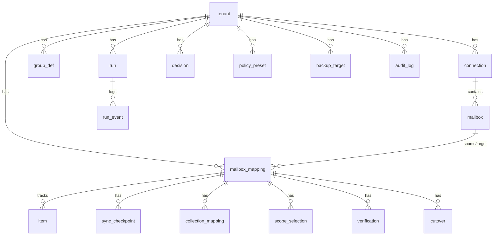

# packages/ledger

The **ledger** is the table of record for the migration core: idempotency mapping, sync checkpoints, drift decisions, runs, verification, cutover, and the optional extra-backup config. The **same schema** is used in both editions (managed: PostgreSQL + RLS; self-host: SQLite or a small Postgres). Canonical DDL: `migrations/0001_init.sql`. Rationale: ADR-0005, ADR-0010, ADR-0016.

## Entities (overview)

## How it backs the architecture
- **Idempotency (§10).** `item` holds one row per source item, keyed by a stable `natural_key` (Message-ID / iCal UID(+RECURRENCE-ID) / vCard UID / file path). `UNIQUE (tenant_id, mapping_id, natural_key_hash)` is the idempotency anchor; `content_hash` drives create/update/skip. Re-running converges -> no duplicates.
- **Stable identity (§11.1).** `mailbox.external_id` stores the **immutable Graph GUID**, so a rename/address change is an UPDATE, not delete+create.
- **Cheap incremental shadow (§10).** `sync_checkpoint` stores the per-collection delta token (Graph deltaLink / CalDAV sync-token / IMAP UIDVALIDITY+UIDNEXT+HIGHESTMODSEQ / ctag).
- **Sent & special-use (§10.1).** `collection_mapping` records "Sent Items" -> "Sent" (`\Sent`) etc.
- **Shared addresses (§14.1).** `mailbox_mapping.pattern` = `shared_s` (Pattern S, full-tree copy) or `distribution_d`; Pattern D groups live in `group_def` (definition + members, no store).
- **Non-destructive (§11.1).** Source deletions are recorded as `status = deleted_source`/`tombstoned`; they are **never auto-applied** to the target.
- **Decision queue (§11.2).** `decision` is the "actions required" inbox; `policy_preset` sets per-category auto vs ask.
- **Cutover gate (§11/§20).** `verification` feeds the gate; `cutover` tracks state.
- **Optional extra backup (ADR-0015).** `backup_target` holds the opt-in, user-chosen destination.
- **Runs & audit.** `run`/`run_event` give status/progress (links to the Trigger.dev run via `orchestrator_ref`); `audit_log` records control actions.

## Secrets
No secrets in the ledger. `connection.secret_ref` / `backup_target.secret_ref` point to the vault.

## GDPR erasure
Every tenant-scoped table has `ON DELETE CASCADE` from `tenant`, so deleting a tenant purges all its data (right to erasure).

## Multi-tenancy
- **Managed (Postgres):** RLS on every tenant-scoped table; the app sets `app.current_tenant` per request. Pattern shown in the DDL.
- **Self-host (SQLite):** single tenant; still always filter by `tenant_id`.

## Access layer & migrations
SQL is the source of truth here. Recommended TS access layer: **Drizzle ORM** (first-class PostgreSQL **and** SQLite, lightweight, agent-friendly), with migrations via Drizzle Kit or plain SQL files in `migrations/`. Kysely or Prisma are acceptable alternatives.

## SQLite (self-host) substitutions
| Postgres | SQLite |
|---|---|
| `uuid` + `gen_random_uuid()` | `text` UUID generated in app |
| `jsonb` | `text` (JSON) or JSON1 functions |
| `timestamptz` + `now()` | `text` (ISO-8601) or integer epoch |
| `bytea` | `blob` |
| Row-Level Security | not available — enforce `tenant_id` in queries (single tenant anyway) |

`CHECK` constraints and partial indexes (`... WHERE`) work in both, so the logical schema is identical.
